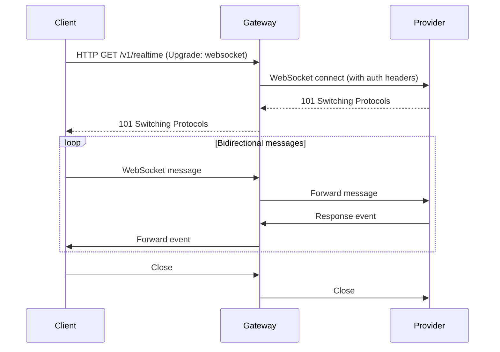

The Realtime endpoint upgrades an HTTP connection to a WebSocket and proxies bidirectional messages between your client and the upstream provider (e.g. OpenAI Realtime API). The gateway handles authentication, event parsing, and connection lifecycle management.

## WebSocket endpoint

`GET /v1/realtime`

Upgrades the connection to a WebSocket. The client sends a standard HTTP `Upgrade: websocket` request; the gateway establishes a corresponding WebSocket connection to the upstream provider and bridges all messages.

### Request headers

<ParamField header="Upgrade" type="string" required>
  Must be `websocket`.
</ParamField>

<ParamField header="x-portkey-provider" type="string" required>
  The provider to connect to (e.g. `openai`). The gateway uses this to determine the upstream WebSocket URL and authentication headers.
</ParamField>

<ParamField header="x-portkey-api-key" type="string" required>
  Your Portkey API key or the provider API key.
</ParamField>

<ParamField header="x-portkey-virtual-key" type="string">
  A Portkey virtual key that resolves provider credentials automatically.
</ParamField>

### Response

A successful upgrade returns HTTP `101 Switching Protocols`. Once upgraded, the connection is a standard WebSocket. Messages sent on the client side are forwarded to the provider; messages received from the provider are forwarded back to the client.

## Runtime support

<Tabs>
  <Tab title="Cloudflare Workers (workerd)">
    The Realtime handler is registered only when the gateway runs in the `workerd` runtime (Cloudflare Workers). It uses the Cloudflare `WebSocketPair` API to accept the client connection and then opens an outgoing WebSocket to the provider via `fetch()` with the `Upgrade: websocket` header.

    ```typescript
    // workerd runtime — uses WebSocketPair
    const webSocketPair = new WebSocketPair();
    const [client, server] = Object.values(webSocketPair);
    server.accept();
    // bridges to outgoing provider WebSocket
    return new Response(null, { status: 101, webSocket: client });
    ```

    Deploy to Cloudflare Workers to use the Realtime endpoint in production.
  </Tab>
  <Tab title="Node.js">
    On Node.js the gateway uses the `ws` package and Hono's WebSocket adapter (`hono/ws`) via `realtimeHandlerNode.ts`. The handler opens the upstream WebSocket before accepting the client connection, ensuring the provider connection is ready before messages start flowing.

    ```typescript
    // Node.js runtime — uses ws package
    import WebSocket from 'ws';

    const outgoingWebSocket = new WebSocket(url, { headers });
    await new Promise((resolve) => {
      outgoingWebSocket.addEventListener('open', resolve);
    });
    ```

    <Note>
      On Node.js, WebSocket error responses are written directly to the raw TCP socket because HTTP/1.1 upgrade responses cannot go through the normal Hono response pipeline.
    </Note>
  </Tab>
</Tabs>

## Connect from a client

You can connect using any standard WebSocket client. Pass the provider and authentication details in the HTTP upgrade request headers.

<CodeGroup>

```javascript Browser / Node.js
import WebSocket from "ws";

const ws = new WebSocket("wss://your-gateway.example.com/v1/realtime", {
  headers: {
    "x-portkey-api-key": "YOUR_API_KEY",
    "x-portkey-provider": "openai",
  },
});

ws.on("open", () => {
  console.log("Connected to Portkey Realtime gateway");
  ws.send(JSON.stringify({
    type: "session.update",
    session: {
      modalities: ["text"],
      model: "gpt-4o-realtime-preview",
    },
  }));
});

ws.on("message", (data) => {
  const event = JSON.parse(data.toString());
  console.log("Received:", event.type);
});

ws.on("close", () => console.log("Connection closed"));
ws.on("error", (err) => console.error("WebSocket error:", err));
```

```python Python
import websocket
import json

def on_open(ws):
    print("Connected")
    ws.send(json.dumps({
        "type": "session.update",
        "session": {
            "modalities": ["text"],
            "model": "gpt-4o-realtime-preview",
        },
    }))

def on_message(ws, message):
    event = json.loads(message)
    print("Received:", event.get("type"))

def on_error(ws, error):
    print("Error:", error)

def on_close(ws, code, reason):
    print("Connection closed")

ws = websocket.WebSocketApp(
    "wss://your-gateway.example.com/v1/realtime",
    header={
        "x-portkey-api-key": "YOUR_API_KEY",
        "x-portkey-provider": "openai",
    },
    on_open=on_open,
    on_message=on_message,
    on_error=on_error,
    on_close=on_close,
)
ws.run_forever()
```

</CodeGroup>

## Using the OpenAI Realtime SDK

You can use the official OpenAI Realtime API SDK and point it at the Portkey gateway by overriding the base URL.

```javascript JavaScript
import { RealtimeClient } from "@openai/realtime-api-beta";

const client = new RealtimeClient({
  url: "wss://your-gateway.example.com/v1/realtime",
  apiKey: "YOUR_API_KEY",
  dangerouslyAllowAPIKeyInBrowser: true,
});

// Add custom headers for the Portkey gateway
// The SDK forwards extra headers on the WebSocket upgrade request
client.realtime.defaultHeaders = {
  "x-portkey-provider": "openai",
};

await client.connect();

client.sendUserMessageContent([
  { type: "input_text", text: "Hello from Portkey!" },
]);

client.on("conversation.updated", ({ item, delta }) => {
  if (delta?.text) process.stdout.write(delta.text);
});
```

<Note>
  The OpenAI Realtime SDK connects directly to `wss://api.openai.com/v1/realtime` by default. Overriding `url` with your gateway address routes the connection through Portkey, enabling logging, virtual keys, and other gateway features.
</Note>

## Event flow


