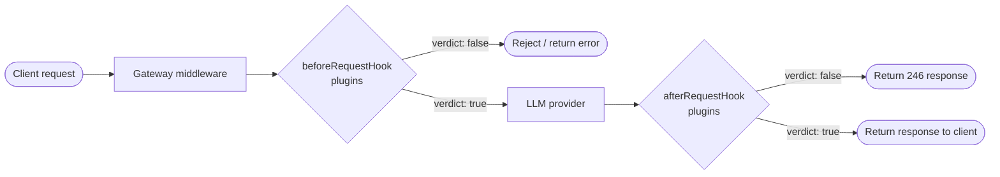

The plugin system lets you extend the Portkey AI Gateway with custom guardrail and transformer logic that runs at well-defined points in the request lifecycle. Plugins are the primary mechanism for enforcing content policies, validating inputs and outputs, and mutating request or response data.

## Plugin discovery

Plugins live in the `plugins/` directory at the root of the gateway repository. Each plugin occupies its own subdirectory:

```
plugins/
  default/          # Built-in guardrails (always loaded)
    manifest.json
    contains.ts
    regexMatch.ts
    webhook.ts
    ...
  your-plugin/      # Custom plugin
    manifest.json
    yourFunction.ts
```

Which plugins are active is controlled by the `plugins_enabled` array in `conf.json`:

```json conf.json
{
  "plugins_enabled": ["default", "your-plugin"],
  "credentials": {
    "your-plugin": {
      "apiKey": "your-api-key"
    }
  },
  "cache": false
}
```

The build step (`npm run build-plugins`) reads `conf.json`, iterates over each enabled plugin directory, imports its `manifest.json`, and auto-generates `plugins/index.ts`. That generated file exports a `plugins` object keyed by plugin ID, which the gateway imports at startup.

<Note>
The `default` plugin ships with the gateway and is almost always included in `plugins_enabled`. It provides built-in guardrails such as `regexMatch`, `contains`, `wordCount`, and `webhook`.
</Note>

## Plugin structure

Every plugin directory must contain:

| File | Purpose |
|---|---|
| `manifest.json` | Declares the plugin's ID, name, credentials schema, and available functions |
| `<functionId>.ts` | One TypeScript file per function declared in the manifest |
| `*.test.ts` | (Recommended) Jest test file for the plugin |

The function file must export a named `handler` that conforms to the `PluginHandler` type.

## TypeScript interfaces

All types are defined in `plugins/types.ts`:

```typescript plugins/types.ts
export interface PluginContext {
  [key: string]: any;
  requestType?: 'complete' | 'chatComplete' | 'embed' | 'messages';
  provider?: string;
  metadata?: Record<string, any>;
}

export interface PluginParameters<K = Record<string, string>> {
  [key: string]: any;
  credentials?: K;
}

export interface PluginHandlerResponse {
  error: any;
  verdict?: boolean;
  // The data object can be any JSON object or null.
  data?: any | null;
  transformedData?: any;
  transformed?: boolean;
}

export type HookEventType = 'beforeRequestHook' | 'afterRequestHook';

export type PluginHandler<P = Record<string, string>> = (
  context: PluginContext,
  parameters: PluginParameters<P>,
  eventType: HookEventType,
  options?: {
    env: Record<string, any>;
    getFromCacheByKey?: (key: string) => Promise<any>;
    putInCacheWithValue?: (key: string, value: any) => Promise<any>;
  }
) => Promise<PluginHandlerResponse>;
```

### PluginContext

`PluginContext` carries the live request and response data your handler can inspect. Key properties:

- `context.request.json` — The parsed request body sent to the LLM provider.
- `context.response.json` — The parsed response body from the LLM provider (available in `afterRequestHook` only).
- `context.requestType` — One of `chatComplete`, `complete`, `embed`, or `messages`.
- `context.provider` — The target LLM provider (e.g. `openai`, `anthropic`).
- `context.metadata` — Arbitrary key-value metadata forwarded with the request.

### PluginHandlerResponse

Handlers must resolve to a `PluginHandlerResponse`:

| Field | Type | Description |
|---|---|---|
| `error` | `any` | `null` on success, or the caught error object |
| `verdict` | `boolean` | `true` = check passed, `false` = check failed |
| `data` | `any` | Arbitrary diagnostic data returned to the caller |
| `transformedData` | `any` | Modified request/response payload (transformer plugins only) |
| `transformed` | `boolean` | Set to `true` when `transformedData` carries changes |

## Hook types

Two hook points are supported:

### beforeRequestHook

Executed **before** the gateway forwards the request to the LLM provider. Use this hook to:

- Validate or reject incoming prompts.
- Enforce model allowlists.
- Mutate the request payload before it reaches the model.

When a `beforeRequestHook` guardrail returns `verdict: false`, the gateway can short-circuit the request entirely and return an error to the caller without ever contacting the LLM.

### afterRequestHook

Executed **after** the LLM response is received but **before** it is returned to the client. Use this hook to:

- Validate LLM output against a schema or content policy.
- Detect PII or sensitive data in responses.
- Mutate or redact response content before delivery.

When an `afterRequestHook` guardrail returns `verdict: false`, the gateway can return the response with HTTP status `246` to signal that guardrails failed.

## Function types

### guardrail

A `guardrail` function evaluates content and returns a boolean `verdict`. The verdict determines whether the request or response is allowed to proceed. Guardrails are the most common plugin type.

```typescript
// excerpt from plugins/default/contains.ts
return { error, verdict, data };
//              ^ true or false
```

### transformer

A `transformer` function mutates the request or response payload. It returns `transformed: true` along with a `transformedData` object containing the modified payload. The `addPrefix` built-in function is an example of a transformer.

```typescript
// transformer response shape
return {
  error: null,
  verdict: true,
  data: { explanation: 'Prefix added.' },
  transformedData: { request: { json: updatedJson } },
  transformed: true,
};
```

## Request pipeline

The following diagram shows where plugins execute within a single gateway request:



All enabled `beforeRequestHook` plugins run in sequence before the upstream call. All enabled `afterRequestHook` plugins run in sequence after the upstream response is received. A single `false` verdict is sufficient to trigger the configured failure action (deny or flag).

## Utility helpers

`plugins/utils.ts` exports helpers for common tasks:

| Helper | Description |
|---|---|
| `getText(context, eventType)` | Extracts the relevant text from the request or response based on `requestType` |
| `getCurrentContentPart(context, eventType)` | Returns the raw content and text array for the active part |
| `setCurrentContentPart(context, eventType, transformedData, textArray)` | Writes modified text back into the request or response payload |
| `post(url, data, options, timeout)` | HTTP POST with timeout and structured error handling |
| `HttpError` | Typed error for non-2xx HTTP responses |
| `TimeoutError` | Typed error for fetch timeouts |

Use `getText` in almost every guardrail — it handles all `requestType` variants automatically so you do not need to branch on `chatComplete` vs `complete` vs `embed` yourself.
